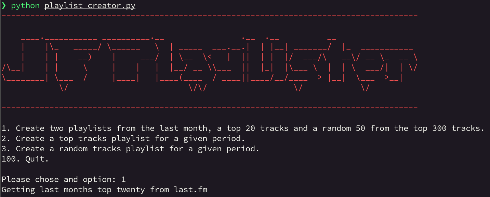
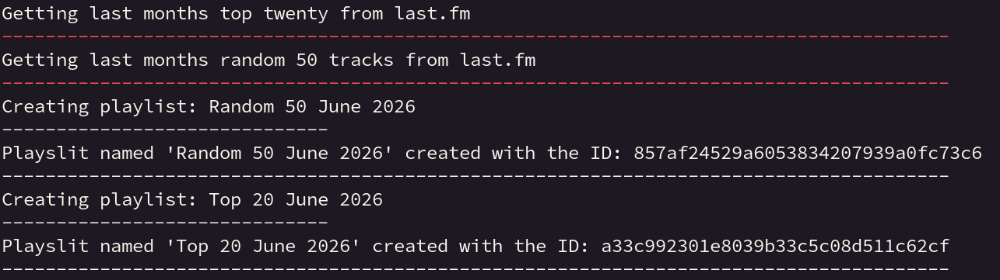

```ascii
    ____.___________ __________.__                .__  .__          __                
    |    |\_   _____/ \______   \  | _____  ___.__.|  | |__| _______/  |_  ___________ 
    |    | |    __)    |     ___/  | \__  \<   |  ||  | |  |/  ___/\   __\/ __ \_  __ \
/\__|    | |     \     |    |   |  |__/ __ \\___  ||  |_|  |\___ \  |  | \  ___/|  | \/
\________| \___  /     |____|   |____(____  / ____||____/__/____  > |__|  \___  >__|   
            \/                         \/\/                  \/            \/       
```
A janky python script to create JellyFin playlists based on the tracks that you;ve scrobbled to [last.fm](https://last.fm).  
  
Requirements:  
`pip install dotenv requests`  
  
You will need a last.fm and JellyFin API keys:  
- For last.fm follow their instructions [here](https://www.last.fm/api).  
- For JellyFin on your server got to `Dashboard > API Keys > New API Key`  
  
Add your API key and some other values to the `.env` file:  
```bash
JF_API_KEY="jellyfin_api_key"
JF_URL="https://domain.to.jf.server"
LASTFM_API_KEY="lastfm_api_key"
LASTFM_SHARED_SECRET="lastfm_api_secret"
LASTFM_USER="lastfm_username"
```
  
Then run with and follow the on screeen instructions:  
`python playlist_creator.py`  
  
Screens:  

